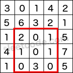

\# 304 Range Sum Query 2D - immutable -- medium
##### description:
给一个二维数组，之后再多次求不同的rectangle之中数字之和

****************
##### 思路:
将二维数组中的每个数设置为从0到这个位置的cumulative sum，之后再将多余的部分减去


$sum(A,B,C,D) = sum(OD) - sum(OB) - sum(OC) + sum(OA)$
time complexity:
pre-computation: O(mn)
query: O(1)
**********
##### 失误点：
dp的row和col都加一，确保不会出界
matrix为空的情况
********
##### Code:
```
class NumMatrix {
    int[][] dp;
    public NumMatrix(int[][] matrix) {
        int rows = matrix.length;

        if (rows == 0 || matrix[0].length == 0) {
            return;
        }

        int cols = matrix[0].length;

        dp = new int[rows + 1][cols + 1];

        for (int r = 0; r < rows; r++) {
            for (int c = 0; c < cols; c++) {
                dp[r + 1][c + 1] = dp[r][c + 1] + dp[r + 1][c] + matrix[r][c] - dp[r][c];
            }
        }
    }

    public int sumRegion(int row1, int col1, int row2, int col2) {
        return dp[row2 + 1][col2 + 1] - dp[row1][col2 + 1] - dp[row2 + 1][col1] + dp[row1][col1];
    }
}

/**
 * Your NumMatrix object will be instantiated and called as such:
 * NumMatrix obj = new NumMatrix(matrix);
 * int param_1 = obj.sumRegion(row1,col1,row2,col2);
 */
```
