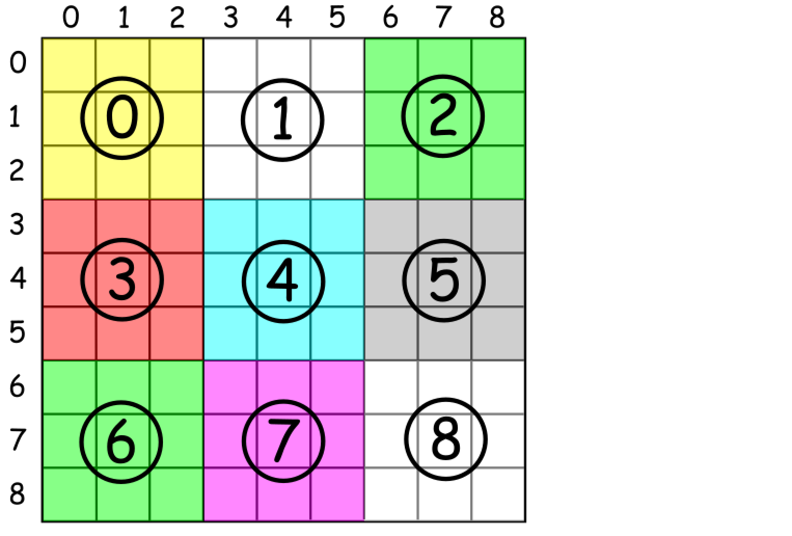

\# 36 Valid Sudoku -- medium
##### description:
判断sudoku是否valid：
一列包含数字1-9,没有重复
一行包含数字1-9,没有重复
一个3x3格子内包含1-9,没有重复
****************
##### 思路:
官方solution是给每行每列每个subbox一个hashmap，但这样做太废空间了
最好是先check row，再check col，再check subbox；subbox最费时，放在最后面check
每个subbox的index可以由如下公式获得
box_index = (row / 3) * 3 + columns / 3

time complexity O(81 * 3),最多这么多，如果前面checkRow或者checkCol返回false，直接结果就是false
**********
##### Code:
```
class Solution {
    char[][] board;
    public boolean isValidSudoku(char[][] board) {
        this.board = board;
        return checkRow() & checkCol() & checkBox();
    }

    public boolean checkRow() {      
        for (char[] row : board) {
            boolean[] numArr = new boolean[10];
            for (char c : row) {
                if (!Character.isDigit(c)) continue;
                int index = Character.getNumericValue(c);
                if (numArr[index]) {
                    return false;
                }
                else {
                    numArr[index] = true;
                }
            }
        }
        return true;
    }

    public boolean checkCol() {
        for (int c = 0; c < board[0].length; c++) {
            boolean[] numArr = new boolean[10];
            for (int r = 0; r < board.length; r++) {
                char ch = board[r][c];
                if (!Character.isDigit(ch)) continue;
                int index = Character.getNumericValue(ch);
                if (numArr[index]) {
                    return false;
                }
                else {
                    numArr[index] = true;
                }
            }
        }
        return true;
    }

    public boolean checkBox() {
        for (int i = 0; i < 9; i++) {
            if (!checkSub(i)) {
                return false;
            }
        }
        return true;
    }

    public boolean checkSub(int index) {
        boolean[] numArr = new boolean[10];
        int startR = index / 3 * 3;
        int startC = index % 3 * 3;
        for (int r = 0; r < 3; r++) {
            for (int c = 0; c < 3; c++) {
                char ch = board[startR + r][startC + c];
                if (!Character.isDigit(ch)) continue;
                int d = Character.getNumericValue(ch);
                if (numArr[d]) {
                    return false;
                }
                else {
                    numArr[d] = true;
                }
            }
        }
        return true;
    }
}
```
