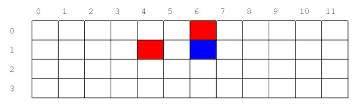
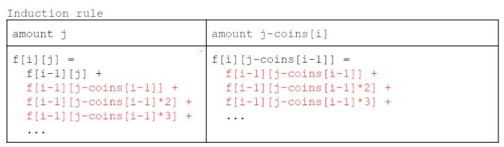
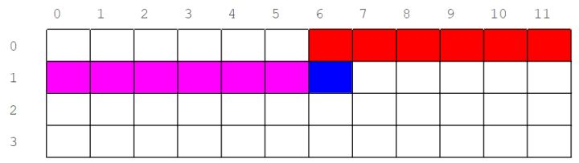

\# 518 Coin Change 2 -- medium
##### description:
array中的值表示coins的面值
给一个target amount，求有多少种方法
****************
##### 思路:
思路1：
最基础的思路是recursive，但是超时了
recursive要注意的是helper call helper的时候也要记录当前的i值，下一级的helper只能从i往小的遍历，大的不能再遍历，否则会出现重复，比如
amount = 5， coins = [1,2,5]
如果不设置index限制，当iterate 2时，能得到结果2,2,1;iterate到1时，又会得到结果2,1,2;得到重复结果
思路2：
dynamic programming
这道题是典型的knapsack背包问题，这种问题一般使用二维数组解答，见[youtube教程](https://www.youtube.com/watch?v=zRza99HPvkQ)
这里的思路参见[知乎](https://zhuanlan.zhihu.com/p/36210712)
最初的思路仍然是二维数组
row是coin的面值种类，col是0-amount
`arr[i][j] = the number of combination to make up amount j with the first i types of coins`

arr[0][0]为1，arr[0][1...amount]为0；0个coin面值可以组成0，但是不能组成其他面值
对于其他数值,每个数值arr[i][j]可以由一下数值相加得到：
arr[i - 1][j]:由前i-1种coin组成amount j的方法
arr[i - 1][j - coin[i]]:前i-1种面值组成amount的方法中不可能包含面值coin[i],但是如果要加入coin[i]，就需要在amount上减去一定数目的coin[i],所以要减一倍减两倍...coin[i]。这个表达式的意义就是由前i-1种coin组成amount j-coin[i]的方法
```
arr[i][j] = sum(arr[i-1][j],               // use coins[i-1] 0 times
             arr[i-1][j-coins[i]],     // use coins[i] 1 time
             arr[i-1][j-coins[i]*2],   // use coins[i] 2 times
             arr[i-1][j-coins[i]*3],   // use coins[i] 3 times
             ...)
```
而这种加法存在很多重复计算：

*图中有错误：-coin[i],不是-coin[i - 1]
所以可以进一步优化
```
arr[i][j] = arr[i - 1][j] + arr[i][j - coin[i]]
```
由此可见arr[i][j]只与arr[i - 1][j]， arr[i][j - coin[i]]有关，如第一个图所示
所以可以进一步优化为一维数组，如下图：

在一维数组中，左侧是同行的结果，右侧是上一行的结果
time complexity
**********
##### 失误点：
amount为0，则expected的结果为1
********
##### Code:
recursive思路超时
```
class Solution {
    int ans;
    int[] coins;
    public int change(int amount, int[] coins) {
        if (amount == 0) return 1;

        ans = 0;
        this.coins = coins;
        helper(coins.length - 1, amount);
        return ans;
    }

    public void helper(int index, int target) {
        if (target == 0) {
            ans++;
            return;
        }
        if (target < 0) {
            return;
        }

        for (int i = index; i >= 0; i--) {
            helper(i, target - coins[i]);
        }

    }
}
```
##### 改进：
思路2 dynamic programm：
```
class Solution {
    public int change(int amount, int[] coins) {
        int[] dp = new int[amount + 1];
        dp[0] = 1;

        for (int coin : coins) {
            for (int i = 0; i <= amount; i++) {
                if (i - coin >= 0) {
                    dp[i] = dp[i] + dp[i - coin];
                }              
            }
        }

        return dp[amount];
    }
}
```
